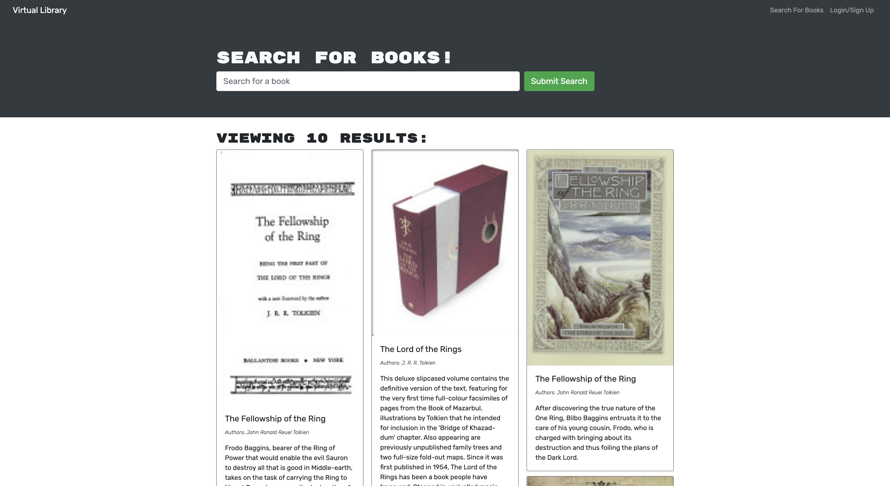

# Book Search Engine Starter Code 📕

With Virtual Library users can search for books they might be interested in. Virtual Lirabry also lets logged-in users save their favorite books to local storage.

Initally built with a REST API Virtual Library has been refactored to use GraphQL query language.

## Licensing

## Usage

Type the book you would like to find on the home page, once the API brings back the books, click on "save book". Saved books can be found on the "saved books" crumb located ted at the top of the site.

## Technologies

- Graph Ql
- Mongodb
- Mongoose
- Apollo Server and Client
- Google Books API
- React
- Bootstrap
- React Router
- Node.js

## Questions

My GitHub username is DavidebCurtis, you can view my profile [here](https://github.com/DavidebCurtis).
If you have any questions and would like to get in touch my email adress is heythereimdavidcurtis@gmail.com
